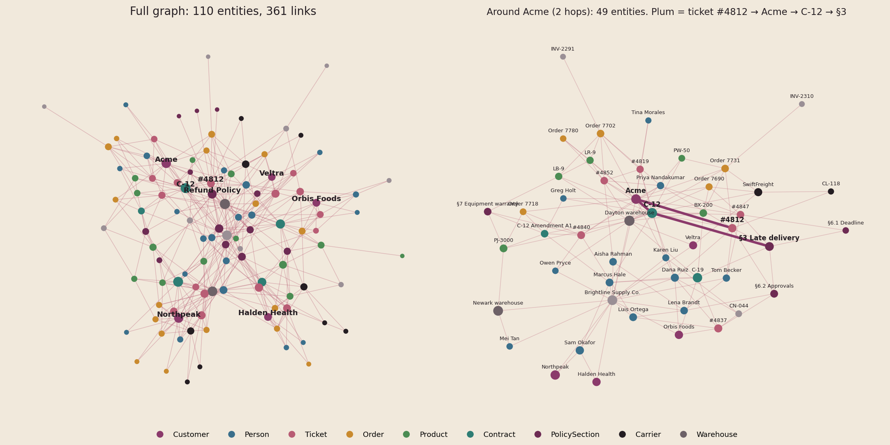

# Dataset v3 · used from episode 03

The dataset shown in [03 · What Actually Happens to Your Documents Before an AI Can Use Them](../../episodes/03-what-happens-to-your-documents/). The content is the same as [v2](../02-knowledge-graph-vs-regular-rag/): Brightline Supply Co., 16 tickets, 4 contracts + amendment A1, refund policy §1–8. What's new is how it arrives. These are **PDFs with a running header and footer on every page**, the way real documents come out of a support desk or a contracts system.

**Upload the three PDFs.** The markdown files are the clean source text, kept here so you can compare a clean file with its PDF.

| File | Pages | Header (every page) | Footer (every page) |
|---|---|---|---|
| [`01_support_tickets.pdf`](01_support_tickets.pdf) | 8 | Brightline Supply Co. · Support Desk Export · 14–25 Sep 2026 · CONFIDENTIAL | BL-SUP-2026-09 · Printed 28 Sep 2026 · Page n of 8 |
| [`02_customer_contracts.pdf`](02_customer_contracts.pdf) | 3 | Brightline Supply Co. · Customer Contracts · Summary · CONFIDENTIAL | BL-CON-2026-04 · Printed 28 Sep 2026 · Page n of 3 |
| [`03_refund_policy.pdf`](03_refund_policy.pdf) | 2 | Brightline Supply Co. · Refund Policy v2 · INTERNAL | BL-POL-003 · Printed 28 Sep 2026 · Page n of 2 |
| [`01_support_tickets.md`](01_support_tickets.md), [`02_customer_contracts.md`](02_customer_contracts.md), [`03_refund_policy.md`](03_refund_policy.md) | | clean source text (identical to v2) | |
| [`graph/`](graph/) | | reference graph: 110 entities, 364 relationships (identical to v2) | |
| [`questions.md`](questions.md) | | v2's 22 test questions + 4 preprocessing checks for this episode | |



## What changed from v2

- New: the three PDFs, generated from the v2 markdown with a running header and footer (13 pages in total, so the same header and footer repeat 13 times).
- Why: episode 3 is about preprocessing. Without cleaning, the header and footer end up inside your chunks. Ticket **#4815** is the example. Its customer message is on page 1, and its agent note is on page 2. In between, the raw text contains the page-1 footer and the page-2 header:

```
Customer message: Jonas Weber says order 7740 arrived on 14 September with one pallet crushed.
Photos attached. Northpeak wants a replacement pallet, not a refund.
BL-SUP-2026-09 · Printed 28 Sep 2026                                    Page 1 of 8
Brightline Supply Co. · Support Desk Export · 14–25 Sep 2026            CONFIDENTIAL
Agent note: Damage reported within 24 hours, well inside the 14 days in section 4.1. …
```

- Answers don't change: every v2 question has the same expected answer in v3.
