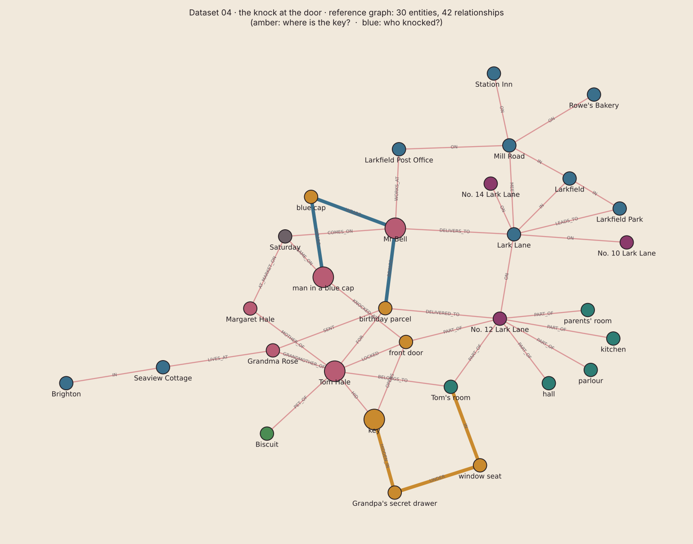

# Dataset v4 · used from episode 04

The dataset shown in [04 · How Does a Document Become a Graph?](../../episodes/04-how-does-a-document-become-a-graph/). Unlike the other episodes, it doesn't use the Brightline Supply Co. files: episode 4 explains the graph with an escape-room story, so the data *is* the escape room.

**The story.** Saturday, 1957, No. 12 Lark Lane. Tom is turning eight and is home alone with his dog, Biscuit. A man in a blue cap knocks three times and calls his name. Tom locks the front door and hides the key. You're locked in Tom's house: find the key, and find out who knocked. The clues are four torn documents, one in each room.

| File | Found in | What's inside |
|---|---|---|
| [`01_post_round_map.md`](01_post_round_map.md) | room 1 · hallway | The postman's Saturday round: Mr Bell, Lark Lane (Nos. 10, 12, 14), a parcel for No. 12, signature needed |
| [`02_letter.md`](02_letter.md) | room 2 · parlour | Grandma Rose's birthday letter: a parcel is coming with the new postman, Mr Bell, on Saturday; he wears a blue cap |
| [`03_floor_plan.md`](03_floor_plan.md) | room 3 · corridor | Floor plan of "12 Lark Ln": the front door; Tom's room (the blue bedroom) with Grandpa's secret drawer under the window seat |
| [`04_diary.md`](04_diary.md) | room 4 · blue bedroom | Three pages of Tom's diary: birthday tomorrow; a man in a blue cap knocked, Tom locked the door and hid the key in Grandpa's secret drawer |
| [`pdf/`](pdf/) | | The same four documents as styled PDFs (a postman's map, Grandma's letter, a blueprint floor plan, torn diary pages). The PDF text is word-for-word the `.md` text; the drawings are images, so their labels don't add text. Upload either the `.md` or the `.pdf` set, not both |
| [`graph/`](graph/) | | The reference graph: **30 entities, 42 relationships** (`entities.csv`, `relationships.csv`, `graph_preview.png`) |
| [`questions.md`](questions.md) | | 6 test questions with expected answers, hop counts and paths |

Each file has 2–3 headed pieces; with default settings each piece becomes roughly one chunk (11 in total), the "torn pieces" of the video.

**The two questions from the video** (3 edges each):
- *Where did Tom hide the key?* key → Grandpa's secret drawer → window seat → Tom's room.
- *Who knocked?* man in a blue cap → blue cap ← Mr Bell → birthday parcel. It was the postman, with Tom's birthday present.

**Built-in trap:** the floor plan says "12 Lark Ln". If your graph shows two address nodes, the string breaks (episode 6, entity resolution).

All names, places and events are fictional.
