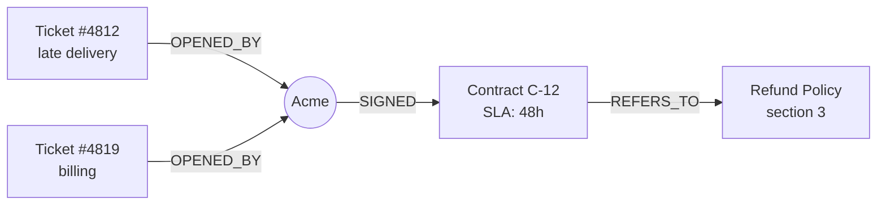

# 01 · What Is a Knowledge Graph?

▶️ **Watch:** {EP1_LINK}

A knowledge graph stores the things in your data and how they connect, so an AI can follow the links instead of guessing.

## What you'll learn

- **Entities** are the things in your data (Acme, a contract, a ticket). Each one becomes a single node, no matter how many documents mention it.
- **Relationships** are the links between them (Acme *signed* the contract, Acme *opened* the ticket). They're the part plain search doesn't keep.
- **Properties** are details that describe one thing (a 48-hour delivery window, a ticket opened on Monday). They live on the node.
- **The test for your own data:** if you'd ever start a question from it, or link it to more than one thing, it's an entity. If it only describes something, it's a property.

## Reproduce it

1. Create a new knowledge base with the knowledge graph turned on.
2. Upload the three files from [`dataset/`](../../dataset/).
3. Let it build the graph, then open the graph view.
4. Find the **Acme** node and open it: look at its properties and the passages that mention it.

Settings used in the video: [`config.md`](config.md).

## What you should see

Acme appears **once**, connected to its two tickets and its contract. The contract links on to the refund policy.

Your relationship names may differ. What matters is that Acme is one node and the links exist.

## Check your graph

| Check | Why it matters |
|---|---|
| Acme is one node, not several | If it appears as "Acme" and "Acme Inc." separately, your graph splits one customer in two. That's entity resolution, covered in episode 6. |
| Ticket #4812 links to Acme | The question starts from the ticket |
| Contract C-12 links to Acme and to the refund policy | These are the hops the AI needs to walk |

Then try question 3 from [`questions.md`](../../questions.md): **"Is Acme owed a refund for ticket #4812?"** It needs three hops: ticket → Acme → contract → policy.

## One thing to watch

An LLM extracts the entities and relationships, so always check which nodes and edges it actually produced. Vector search stores chunks and their embeddings; links between them are only inferred at query time.

**Next:** [02 · Knowledge Graph vs Regular RAG](../) (coming soon)
