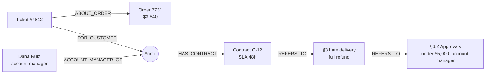

# 02 · Knowledge Graph vs Regular RAG

▶️ **Watch:** {EP2_LINK}

Regular RAG finds what's **near** your question. A knowledge graph finds the **route** to the answer.

## What you'll learn

- **Regular RAG searches by distance.** Every passage becomes an embedding, a point on a map. Your question becomes a point too. Cosine similarity scores how close they are, and only the closest few (top k) reach the AI.
- **Close in meaning isn't the same as connected.** The passages inside that circle aren't linked to each other or to your case.
- **A knowledge graph searches by route.** Facts are stored as triples (node, edge, node). Retrieval picks an **anchor** node, then **traverses** typed edges one hop at a time.
- **When regular RAG is enough:** the answer sits in one passage. If you have to "change trains" across documents, you need the edges.

## Reproduce it

Create a knowledge base with the knowledge graph turned on and upload the three files from [`datasets/02-knowledge-graph-vs-regular-rag/`](../../datasets/02-knowledge-graph-vs-regular-rag/). This is dataset **v2**: bigger than episode 1's (16 tickets instead of 6), so if you built the episode 1 knowledge base, start a new one.

**1. One-stop question (regular RAG is fine).** Ask plain vector search: *"What is the delivery SLA in Acme's contract?"* Contract C-12 should score highest: 48 hours from dispatch confirmation.

**2. Route question (the circle misses).** Ask plain vector search: *"Ticket #4812: who needs to approve Acme's refund?"* Look at the top 3 passages and their similarity scores. Count how many are about ticket #4812 itself.

**3. Same question on the graph.** Start at the **#4812** node and follow its edges:

Settings used in the video: [`config.md`](config.md).

## What you should see

| Search | What reaches the AI |
|---|---|
| Vector search, top 3 | Look-alike passages: a Northpeak late-delivery refund (#4834), the Orbis Foods credit note (CN-044), an old Acme request that was declined (#4847). Similar boxes, carrier and wording; none of them is ticket #4812, and Dana Ruiz isn't among them. |
| Graph, from #4812 | Hop 1: order 7731 and Acme. Hop 2: Dana Ruiz and contract C-12. From there: refund policy §3 (full refund) and §6.2 (the account manager approves under $5,000). Each edge links back to the passage it came from. |

Your scores and relationship names will differ. What matters: the vector top 3 are *similar*, while the graph path is *connected*.

## Check your graph

| Check | Why it matters |
|---|---|
| #4812 → Acme exists | It's hop one. Without it the walk can't start. |
| Acme ↔ Dana Ruiz exists (or C-12 → Dana Ruiz) | It's the destination. Missing it means the graph can't name the approver. |
| Acme → C-12 → §3 exists | It's how the refund rule is reached |
| Every edge opens a source passage | That's what makes the answer checkable |

Then try questions 1, 3 and 7 from [`questions.md`](../../datasets/02-knowledge-graph-vs-regular-rag/questions.md) with both searches. Question 1 is one hop; 3 and 7 need multi-hop traversal.

## One thing to watch

Traversal can only follow edges that were extracted. If the link from Acme to its contract is missing, the walk never reaches it and the AI is back to guessing. Compare your edges with the [reference graph](../../datasets/02-knowledge-graph-vs-regular-rag/graph/relationships.csv). How edges get made is episode 4.

**Previous:** [01 · What Is a Knowledge Graph?](../01-what-is-a-knowledge-graph/)
**Next:** 03 · What Actually Happens to Your Documents Before an AI Can Use Them (coming soon)
