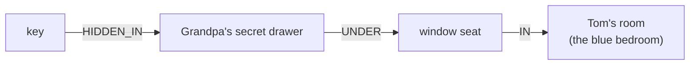

# 04 · How Does a Document Become a Graph?

▶️ **Watch:** {EP4_LINK}

A graph isn't a file you upload. It's what the tool builds from your documents: it reads each piece, pulls out the things and the links, and stitches them into one web. This episode shows that build on a story you can actually solve.

## What you'll learn

- **Documents become chunks first.** The four torn documents are split into pieces (11 in total with default settings). Each piece is a "torn page" the tool reads on its own.
- **Chunks become entities.** The tool reads each piece and pulls out the things in it — people, places, objects. Each thing becomes a node, no matter how many pieces mention it.
- **Chunks become relationships.** It also pulls out the links between things (Mr Bell *brings* the parcel, the key is *hidden in* the drawer). Each link becomes a typed edge.
- **The graph is the union.** Every piece's nodes and edges are merged into one graph. "No. 12 Lark Lane" appears in the map and the floor plan, but it should be a single node.
- **The test is a path.** You can only answer the escape-room questions by following edges: *where did Tom hide the key?* key → drawer → window seat → Tom's room.

## Reproduce it

Create a new knowledge base with the knowledge graph turned on and upload the four files from [`datasets/04-how-does-a-document-become-a-graph/`](../../datasets/04-how-does-a-document-become-a-graph/). This is dataset **v4**: unlike the other episodes it's not the Brightline Supply Co. files — it's an escape-room story, so the data *is* the story. Upload the four `.md` files (or the four styled PDFs in `pdf/`, not both).

**1. Build the graph.** Upload `01_post_round_map.md`, `02_letter.md`, `03_floor_plan.md` and `04_diary.md`. When it's done, open the graph view and note the number of nodes and edges.

**2. Find the pieces.** Open the map file and check its chunks: with default settings each of its three pieces is roughly one chunk. The four documents give 11 chunks in total — the "torn pieces" of the video.

**3. Follow a path.** Start at the **key** node and follow its edges:

That's the answer to *where did Tom hide the key?* — three hops, all from the diary and the floor plan.

Settings used in the video: [`config.md`](config.md).

## What you should see

| Question | Path through the graph | Hops |
|---|---|---|
| Where did Tom hide the key? | key → Grandpa's secret drawer → window seat → Tom's room | 3 |
| Who knocked? | man in a blue cap → blue cap ← Mr Bell → birthday parcel | 3 |

The reference graph has **30 entities and 42 relationships**. Your node and edge counts will differ with your settings. What matters: the two paths above exist, and each edge opens the passage it came from.

## Check your graph

| Check | Why it matters |
|---|---|
| "No. 12 Lark Lane" is one node | The map writes "No. 12 Lark Lane", the floor plan "12 Lark Ln". Two nodes and the postman's round never reaches Tom's room. That's entity resolution, episode 6. |
| key → drawer → window seat → Tom's room exists | It's the answer to the first question |
| man in a blue cap → blue cap ← Mr Bell exists | It's how the graph links the stranger to the postman |
| Every edge opens a source passage | That's what makes the answer checkable |

Then run the six questions in [`questions.md`](../../datasets/04-how-does-a-document-become-a-graph/questions.md).

## One thing to watch

The tool extracts entities and relationships from each chunk with an LLM, so the graph is only as good as what it pulled out. Always open the graph view and check which nodes and edges it actually made — compare yours with the [reference graph](../../datasets/04-how-does-a-document-become-a-graph/graph/relationships.csv). If a link is missing, the walk stops there and the AI is back to guessing.

**Previous:** [03 · What Actually Happens to Your Documents Before an AI Can Use Them](../03-what-happens-to-your-documents/)
**Next:** 05 · What Changes When You Switch From Plain RAG to a Graph? (coming soon)
